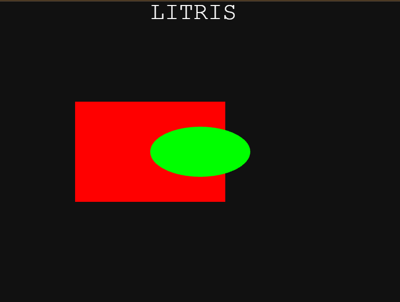

# Entry 4
##### 3/16/26

### How have I progressed
I started to make my game however there is still a bunch of stuff that i have to learn while I make the game. To learn more code that i can potentially use, i browse through the [Phaser Documentation](https://docs.phaser.io/phaser/concepts/geometry) and [examples from Phaser](https://phaser.io/examples/v3.85.0). If i need something really specific that i cannot find I search it up on google. Some things I learned are adding text and different shapes and i have already used them to start making my game. 
#### Text
To make sure users dont confuse my creation as a tetris rip off i used text to add a title. I positioned it in the top middle of the canvas and make it big so ussers can see. I learned by coed from the [Phaser Documentation](https://docs.phaser.io/phaser/concepts/geometry). This is my code:
```js
this.add.text(300, 0, "LITRIS", {
    fontSize: "48px",
    fill: "#ffffff",
});
```
This just adds "LITRIS" on the top of the scareen and i set the size to be big because its a title and i made it white to complement my dark background. 

#### Shapes 
I took me a while to do shapes because my whole game is revolved around shapes. I looked through phaser's information and found many ways to add shapes. Since shapes were so important I used AI to suggest which one i should use to make sure the code supports what im going to do to it and it settled on the code i found from the [examples on Phaser](https://phaser.io/examples/v3.85.0). Here is the code:
```js
let rectangle = this.add.rectangle(300, 300, 300, 200, 0xff0000);
let circle = this.add.ellipse(400, 300, 200, 100, 0x00ff00);
```
I made the shapes into variables because i will mulnipulate their properties later on and now i have two shapes, a rectangle and a ellispe. 
## My progress:


### EDP
I am currently on step 4 and 5 in the engineering design process which is plan the most promising solution and create a prototype. I have already created a plan for the MVP and the beyond MVP for my project. I have also started to create the MVP and made little progress as you could see my code above. I think im going to be at step 5 for a decent amount of time before step 6 which is test and evaluate the prototype because I still have a long way to go beofore completing my MVP. 

### Skills 
#### Embracing failure
The project is not easy for me and everytime i code theres always a problem but thats okay because i always find a solution. When i was making shapes for my game, it wouldnt work at all and i see my classmates's progress so far and it makes me failing even worse. However i didnt let it discourage me and i eventually found my problem which was i was using a outdated version of phaser. Failing made me learn that tons of things can go wrong with your code and sometimes its not even your code. 

[Previous](entry03.md) | [Next](entry05.md)

[Home](../README.md)
